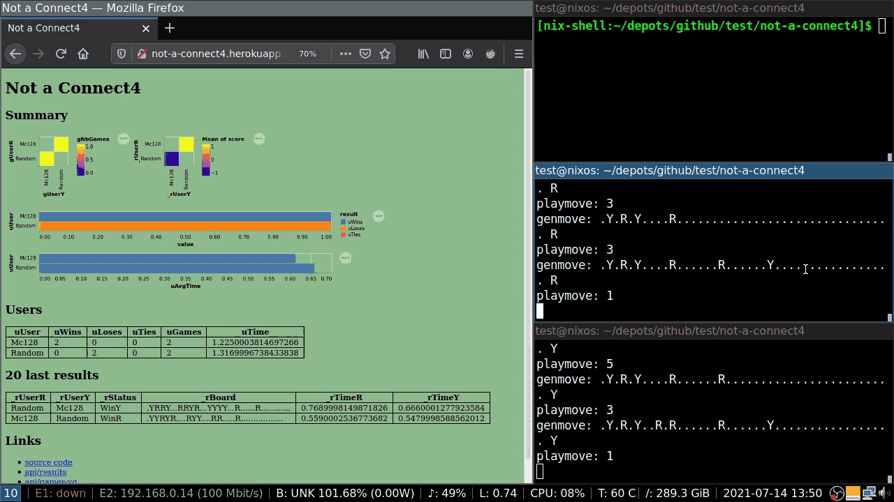

# Not a Connect4

Puissance 4 en réseau pour comparer des IA.

[application heroku](http://not-a-connect4.herokuapp.com/)


https://github.com/nokomprendo/not-a-connect4/raw/master/tmp/nac4.mp4



## Protocole réseau

- websockets
- messages textes utf-8 finissant par " \n"
- username sans espaces (' ', \t, \n, \r)
- BOARD: (. | R | Y)x42                         ; ligne0, ligne1...
- PLAYER: R | Y
- MOVE: 0-6                                     ; numéro colonne
- STATUS : WinR | WinY | Tie | PlayR | PlayY
- move invalide -> annulation partie courante et fin
- déconnexion -> annulation partie courante et fin
- s2c/c2s: server-to-client/client-to-server

```
c2s: connect <username> \n
s2c: connected [message] \n                 ; message d'accueil
s2c: not-connected [message] \n             ; message d'erreur

s2c: newgame <user> <user> \n
s2c: genmove BOARD COLOR \n                 ; board, 1er joueur, joueur courant
c2s: playmove MOVE \n
s2c: endgame BOARD COLOR STATUS \n
```

## Déplyer le serveur sur Heroku

- construire l'image Docker :

```
nix-build docker.nix
docker load -i result
```

- déployer sur Heroku :

```
heroku login
heroku container:login
heroku create not-a-connect4

docker tag not-a-connect4:latest registry.heroku.com/not-a-connect4/web
docker push registry.heroku.com/not-a-connect4/web
heroku container:release web --app not-a-connect4
```

- (ouvrir, éteindre, afficher les logs) :

```
heroku open --app not-a-connect4
heroku ps:scale web=0 --app not-a-connect4
heroku logs --app not-a-connect4
```

## Lancer des clients

- avec stack :

```
stack run nac4-client not-a-connect4.herokuapp.com 80 myname mc 64
```

- avec nix+cabal :

```
nix-shell --run "cabal run nac4-client not-a-connect4.herokuapp.com 80 myname mc 64"
```

## Changelog

- puissance 4
- bots
- serveur http basique
- serveur json basique
- connexion basique client-server WS
- types pour le protocole
- sérialisation protocole/game
- le serveur envoie un jeu et fin
- le serveur stocke les clients dans une map
- le serveur affiche les clients dans la page web
- implémentation client
- enregistre les clients + newgame si 2 clients
- 2 joueurs clients via server
- déploiement docker/heroku
- configuration du bot dans le client
- api json
- results + http
- repetitions des parties + stats
- ajout des graphiques sur l'appli http
- chronométrage des genmoves
- sélection des users (les moins testés d'abord)
- plot du détail des scores
- limite max du nb de parties
- page dynamique

## TODO (ou pas)

- gestion de salons de jeu
- stockage des resultats en bdd
- gestion du temps de jeu
- authentification des users

